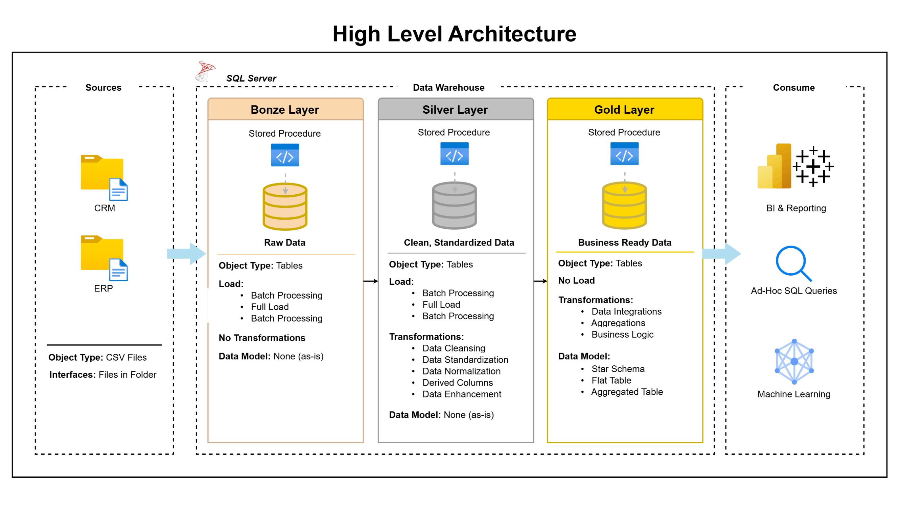
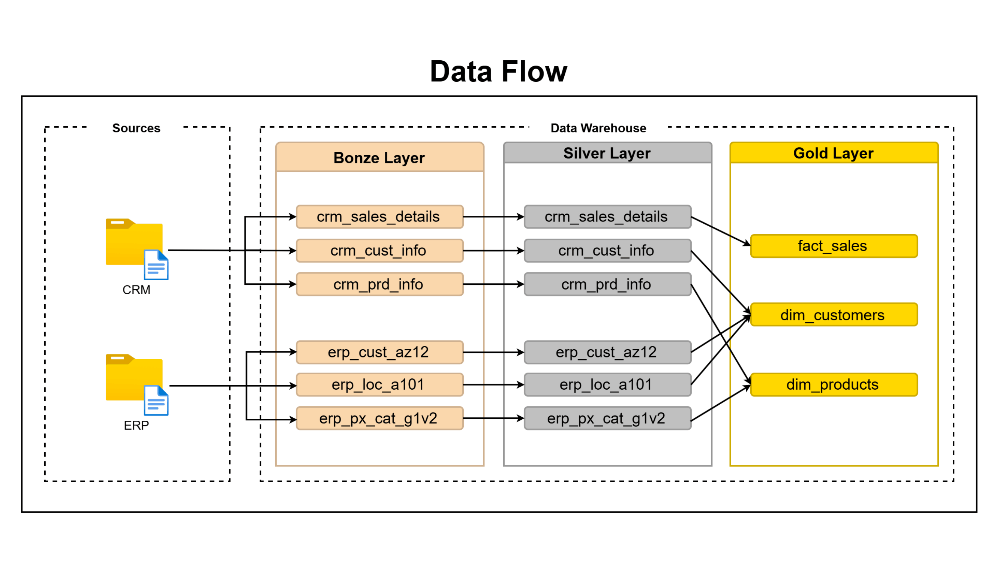
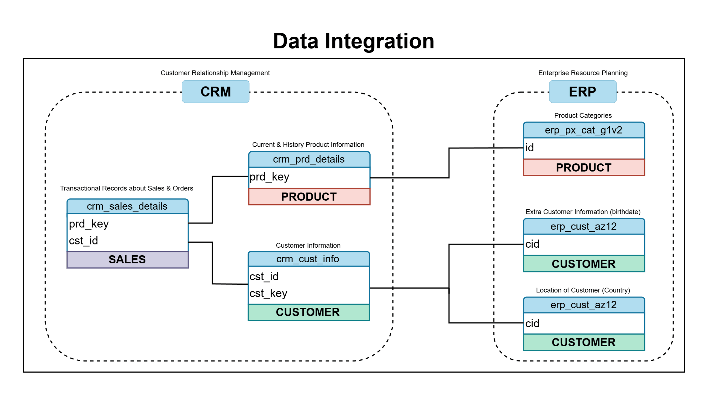
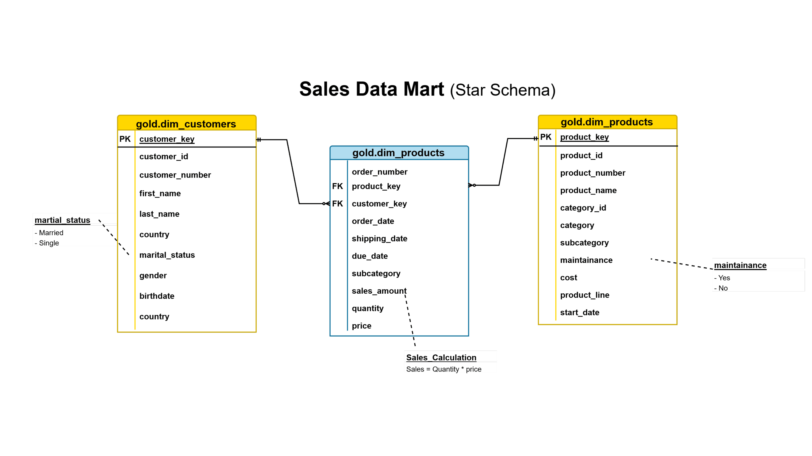

# SQL Data Warehouse Project

A full end-to-end SQL Server data warehouse built on the **Medallion Architecture** (Bronze → Silver → Gold), integrating data from two source systems — CRM and ERP — into a clean, analytics-ready star schema.

---

## Table of Contents

1. [Project Overview](#project-overview)
2. [Architecture](#architecture)
3. [Data Flow](#data-flow)
4. [Data Integration](#data-integration)
5. [Data Model](#data-model)
6. [Repository Structure](#repository-structure)
7. [Source Data](#source-data)
8. [Layer Details](#layer-details)
   - [Bronze Layer](#bronze-layer)
   - [Silver Layer](#silver-layer)
   - [Gold Layer](#gold-layer)
9. [Data Catalog](#data-catalog)
10. [Naming Conventions](#naming-conventions)
11. [Quality Checks](#quality-checks)
12. [Getting Started](#getting-started)

---

## Project Overview

This project implements a modern data warehouse on **Microsoft SQL Server** using a three-layer medallion architecture. Raw data from CRM and ERP source systems is ingested, cleansed, transformed, and finally served as a star schema for business reporting and analytics.

**Key goals:**

- Centralize data from multiple source systems into a single warehouse
- Apply data quality rules and standardization in the Silver layer
- Expose clean, business-friendly dimension and fact views in the Gold layer
- Enable analytical queries on customers, products, and sales

---

## Architecture

The warehouse follows the **Medallion Architecture** pattern with three layers:

| Layer  | Schema   | Purpose                                                 |
| ------ | -------- | ------------------------------------------------------- |
| Bronze | `bronze` | Raw ingestion — exact copy of source CSV data           |
| Silver | `silver` | Cleansed, standardized, and deduplicated data           |
| Gold   | `gold`   | Business-ready views — star schema (dimensions + facts) |



> The diagram above shows the three-layer medallion architecture: source systems feed into Bronze via bulk load, Bronze is transformed into Silver via stored procedures, and Silver is aggregated into Gold views that power reporting.

---

## Data Flow

Data moves through the pipeline in a linear, one-directional flow from source systems through to the analytical layer.



> **Pipeline steps:**
>
> 1. **Source Systems** — CRM and ERP systems export flat CSV files
> 2. **Bronze** — CSV files are bulk-inserted as-is using `EXEC bronze.load_bronze`
> 3. **Silver** — Stored procedure `EXEC silver.load_silver` transforms and cleanses data
> 4. **Gold** — SQL views expose the final star schema; no separate load step required

---

## Data Integration

The Silver layer tables from both source systems are joined and integrated to produce the Gold layer views.



> **Integration logic:**
>
> - `silver.crm_cust_info` + `silver.erp_cust_az12` + `silver.erp_loc_a101` → `gold.dim_customers`
> - `silver.crm_prd_info` + `silver.erp_px_cat_g1v2` → `gold.dim_products`
> - `silver.crm_sales_details` + `gold.dim_products` + `gold.dim_customers` → `gold.fact_sales`

---

## Data Model

The Gold layer implements a **Star Schema** optimised for analytical queries and BI tools.



> The star schema consists of:
>
> - **`gold.dim_customers`** — customer dimension with demographic and geographic attributes
> - **`gold.dim_products`** — product dimension with category, subcategory, and product line
> - **`gold.fact_sales`** — central fact table with order transactions linked to both dimensions via surrogate keys

---

## Repository Structure

```
SQL-Data-Warehous-Project/
│
├── datasets/                         # Raw source CSV files
│   ├── source_crm/
│   │   ├── cust_info.csv             # CRM customer records
│   │   ├── prd_info.csv              # CRM product records
│   │   └── sales_details.csv         # CRM sales transactions
│   └── source_erp/
│       ├── CUST_AZ12.csv             # ERP customer demographics
│       ├── LOC_A101.csv              # ERP customer location/country
│       └── PX_CAT_G1V2.csv          # ERP product categories
│
├── docs/                             # Project documentation & diagrams
│   ├── data_architecture.png         # Medallion architecture diagram
│   ├── data_catalog.md               # Gold layer column-level data catalog
│   ├── data_flow.png                 # End-to-end data pipeline flow
│   ├── data_integration.png          # Table integration/join mapping
│   ├── data_model.png                # Star schema ER diagram
│   └── naming_conventions.md         # Object naming standards
│
├── scripts/                          # All SQL scripts
│   ├── init_database.sql             # Create DataWarehouse DB + schemas
│   ├── bronze/
│   │   ├── ddl_bronze.sql            # Create Bronze tables
│   │   └── proc_load_bronze.sql      # Stored proc: bulk load from CSV
│   ├── silver/
│   │   ├── ddl_silver.sql            # Create Silver tables
│   │   └── proc_load_silver.sql      # Stored proc: transform Bronze → Silver
│   └── gold/
│       └── ddl_gold.sql              # Create Gold views (star schema)
│
└── tests/
    ├── quality_checks_silver.sql     # Data quality checks for Silver layer
    └── quality_checks_gold.sql       # Data quality checks for Gold layer
```

---

## Source Data

Two source systems provide data as CSV files:

### CRM Source (`datasets/source_crm/`)

| File                | Description                                          | Key Columns                                                      |
| ------------------- | ---------------------------------------------------- | ---------------------------------------------------------------- |
| `cust_info.csv`     | Customer master records with demographics            | `cst_id`, `cst_key`, `cst_firstname`, `cst_lastname`, `cst_gndr` |
| `prd_info.csv`      | Product catalogue with pricing and product line info | `prd_id`, `prd_key`, `prd_nm`, `prd_cost`, `prd_line`            |
| `sales_details.csv` | Sales order transactions                             | `sls_ord_num`, `sls_prd_key`, `sls_cust_id`, `sls_sales`         |

### ERP Source (`datasets/source_erp/`)

| File              | Description                                | Key Columns                          |
| ----------------- | ------------------------------------------ | ------------------------------------ |
| `CUST_AZ12.csv`   | Customer birthdate and gender from ERP     | `cid`, `bdate`, `gen`                |
| `LOC_A101.csv`    | Customer country/location data             | `cid`, `cntry`                       |
| `PX_CAT_G1V2.csv` | Product category and subcategory hierarchy | `id`, `cat`, `subcat`, `maintenance` |

---

## Layer Details

### Bronze Layer

**Purpose:** Raw ingestion — data lands exactly as it exists in the source files with no transformations.

**Tables:**

| Table                      | Source File                    |
| -------------------------- | ------------------------------ |
| `bronze.crm_cust_info`     | `source_crm/cust_info.csv`     |
| `bronze.crm_prd_info`      | `source_crm/prd_info.csv`      |
| `bronze.crm_sales_details` | `source_crm/sales_details.csv` |
| `bronze.erp_cust_az12`     | `source_erp/CUST_AZ12.csv`     |
| `bronze.erp_loc_a101`      | `source_erp/LOC_A101.csv`      |
| `bronze.erp_px_cat_g1v2`   | `source_erp/PX_CAT_G1V2.csv`   |

**Load command:**

```sql
EXEC bronze.load_bronze;
```

**Mechanism:** Each table is truncated then reloaded via `BULK INSERT` from its corresponding CSV. Duration is printed per table for monitoring.

---

### Silver Layer

**Purpose:** Cleansed and standardized data ready for integration. Key transformations applied:

| Transformation               | Details                                                                                     |
| ---------------------------- | ------------------------------------------------------------------------------------------- |
| Deduplication                | `crm_cust_info` — keeps most recent record per `cst_id` using `ROW_NUMBER()`                |
| Gender normalization         | `'M'/'F'` codes → `'Male'/'Female'`; unknowns → `'n/a'`                                     |
| Marital status normalization | `'S'/'M'` codes → `'Single'/'Married'`; unknowns → `'n/a'`                                  |
| Product line expansion       | `'M'/'R'/'S'/'T'` → `'Mountain'/'Road'/'Other Sales'/'Touring'`                             |
| Product key extraction       | Category ID and product key split from combined `prd_key` field                             |
| Product end date derivation  | Calculated as one day before the next product's `prd_start_dt`                              |
| Date casting                 | Integer date fields (YYYYMMDD) converted to proper `DATE` type; invalid values → `NULL`     |
| Sales recalculation          | `sls_sales` recalculated as `quantity * ABS(price)` when original value is missing or wrong |
| Country code normalization   | `'DE'` → `'Germany'`, `'US'/'USA'` → `'United States'`                                      |
| Future birthdate handling    | Birthdates in the future set to `NULL`                                                      |
| Customer ID prefix removal   | `'NAS'` prefix stripped from `erp_cust_az12.cid`                                            |
| Whitespace trimming          | Applied across all string fields                                                            |

**Tables:** Same six table names as Bronze, within the `silver` schema. Each table adds a `dwh_create_date DATETIME2` technical column to track when the record was loaded into the warehouse.

**Load command:**

```sql
EXEC silver.load_silver;
```

---

### Gold Layer

**Purpose:** Business-ready star schema implemented as SQL views — no physical data copy, always current. Surrogate keys are generated using `ROW_NUMBER() OVER (ORDER BY ...)` on each view.

**Views:**

| View                 | Type      | Description                                            |
| -------------------- | --------- | ------------------------------------------------------ |
| `gold.dim_customers` | Dimension | Customers enriched with ERP demographics and location  |
| `gold.dim_products`  | Dimension | Products enriched with ERP category hierarchy          |
| `gold.fact_sales`    | Fact      | Sales transactions linked to customer and product dims |

**Create views:**

```sql
-- Run: scripts/gold/ddl_gold.sql
IF OBJECT_ID('gold.dim_customers', 'V') IS NOT NULL DROP VIEW gold.dim_customers;
IF OBJECT_ID('gold.dim_products',  'V') IS NOT NULL DROP VIEW gold.dim_products;
IF OBJECT_ID('gold.fact_sales',    'V') IS NOT NULL DROP VIEW gold.fact_sales;
```

---

## Data Catalog

Full column-level documentation for the Gold layer is in [`docs/data_catalog.md`](docs/data_catalog.md).

### `gold.dim_customers`

| Column            | Type         | Description                           |
| ----------------- | ------------ | ------------------------------------- |
| `customer_key`    | INT          | Surrogate key                         |
| `customer_id`     | INT          | Source system customer ID             |
| `customer_number` | NVARCHAR(50) | Alphanumeric customer reference       |
| `first_name`      | NVARCHAR(50) | Customer first name                   |
| `last_name`       | NVARCHAR(50) | Customer last name                    |
| `country`         | NVARCHAR(50) | Country of residence                  |
| `marital_status`  | NVARCHAR(50) | Married / Single / n/a                |
| `gender`          | NVARCHAR(50) | Male / Female / n/a                   |
| `birthdate`       | DATE         | Date of birth (YYYY-MM-DD)            |
| `create_date`     | DATE         | Record creation date in source system |

### `gold.dim_products`

| Column                 | Type         | Description                                 |
| ---------------------- | ------------ | ------------------------------------------- |
| `product_key`          | INT          | Surrogate key                               |
| `product_id`           | INT          | Source system product ID                    |
| `product_number`       | NVARCHAR(50) | Alphanumeric product reference              |
| `product_name`         | NVARCHAR(50) | Full descriptive product name               |
| `category_id`          | NVARCHAR(50) | Category reference ID                       |
| `category`             | NVARCHAR(50) | Top-level category (e.g. Bikes, Components) |
| `subcategory`          | NVARCHAR(50) | Product subcategory                         |
| `maintenance_required` | NVARCHAR(50) | Yes / No                                    |
| `cost`                 | INT          | Base product cost                           |
| `product_line`         | NVARCHAR(50) | Road / Mountain / Touring / Other Sales     |
| `start_date`           | DATE         | Date product became available               |

### `gold.fact_sales`

| Column          | Type         | Description                       |
| --------------- | ------------ | --------------------------------- |
| `order_number`  | NVARCHAR(50) | Unique sales order identifier     |
| `product_key`   | INT          | FK → `gold.dim_products`          |
| `customer_key`  | INT          | FK → `gold.dim_customers`         |
| `order_date`    | DATE         | Date the order was placed         |
| `shipping_date` | DATE         | Date the order was shipped        |
| `due_date`      | DATE         | Payment due date                  |
| `sales_amount`  | INT          | Total monetary value of line item |
| `quantity`      | INT          | Units ordered                     |
| `price`         | INT          | Price per unit                    |

---

## Naming Conventions

Full conventions documented in [`docs/naming_conventions.md`](docs/naming_conventions.md).

### Object Naming Summary

| Layer  | Pattern               | Example                       |
| ------ | --------------------- | ----------------------------- |
| Bronze | `<source>_<entity>`   | `crm_cust_info`               |
| Silver | `<source>_<entity>`   | `crm_prd_info`                |
| Gold   | `<category>_<entity>` | `dim_customers`, `fact_sales` |

### Column Naming Summary

| Pattern       | Usage                             | Example           |
| ------------- | --------------------------------- | ----------------- |
| `<table>_key` | Surrogate primary keys            | `customer_key`    |
| `dwh_`        | System/technical metadata columns | `dwh_create_date` |

### Stored Procedure Naming

Pattern: `load_<layer>`

```
bronze.load_bronze  →  Load raw data into Bronze
silver.load_silver  →  Transform Bronze into Silver
```

### General Rules

- All names use `snake_case` with lowercase letters
- English only
- No SQL reserved words as object names

---

## Quality Checks

Quality check scripts are in the `tests/` folder and should be run after each layer load.

### Silver Layer Checks (`tests/quality_checks_silver.sql`)

| Check                            | Table(s)                        | Expectation          |
| -------------------------------- | ------------------------------- | -------------------- |
| NULL / duplicate primary keys    | All Silver tables               | No results           |
| Unwanted whitespace in strings   | `crm_cust_info`, `crm_prd_info` | No results           |
| Negative or NULL cost values     | `crm_prd_info`                  | No results           |
| Invalid date order (start > end) | `crm_prd_info`                  | No results           |
| Order date after ship/due date   | `crm_sales_details`             | No results           |
| Sales ≠ quantity × price         | `crm_sales_details`             | No results           |
| Out-of-range birthdates          | `erp_cust_az12`                 | Dates 1924–today     |
| Standardized value consistency   | All tables                      | Review distinct sets |

### Gold Layer Checks (`tests/quality_checks_gold.sql`)

| Check                             | Table(s)        | Expectation |
| --------------------------------- | --------------- | ----------- |
| Duplicate surrogate keys          | `dim_customers` | No results  |
| Duplicate surrogate keys          | `dim_products`  | No results  |
| Orphaned fact rows (no dim match) | `fact_sales`    | No results  |

---

## Getting Started

### Prerequisites

- Microsoft SQL Server 2016 or later
- SQL Server Management Studio (SSMS) or Azure Data Studio
- Source CSV files placed at `C:\sql\dwh_project\datasets\` (or update the paths in `proc_load_bronze.sql`)

### Setup Steps

**1. Initialize the database**

```sql
-- WARNING: Drops and recreates DataWarehouse if it already exists
-- Run: scripts/init_database.sql
USE master;
GO
```

**2. Create Bronze tables**

```sql
-- Run: scripts/bronze/ddl_bronze.sql
```

**3. Create Silver tables**

```sql
-- Run: scripts/silver/ddl_silver.sql
```

**4. Create Gold views**

```sql
-- Run: scripts/gold/ddl_gold.sql
```

**5. Load the Bronze layer**

```sql
EXEC bronze.load_bronze;
```

**6. Load the Silver layer**

```sql
EXEC silver.load_silver;
```

**7. Validate data quality**

```sql
-- Run: tests/quality_checks_silver.sql
-- Run: tests/quality_checks_gold.sql
```

**8. Query the Gold layer**

```sql
SELECT * FROM gold.dim_customers;
SELECT * FROM gold.dim_products;
SELECT * FROM gold.fact_sales;
```

---

## License

This project is licensed under the terms in the [LICENSE](LICENSE) file.
